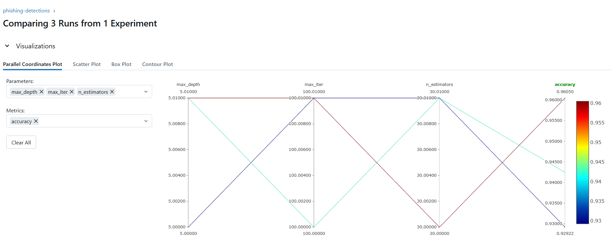
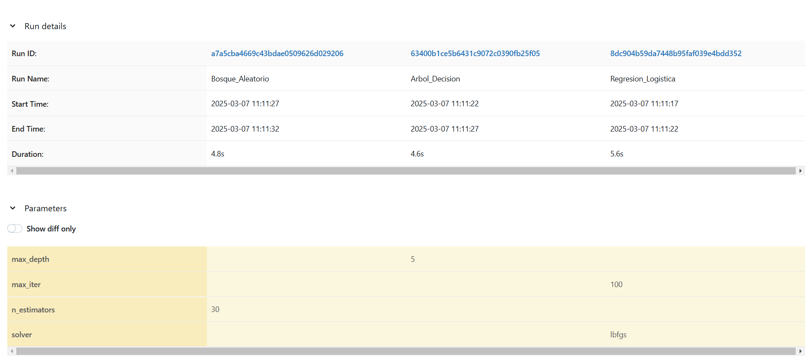
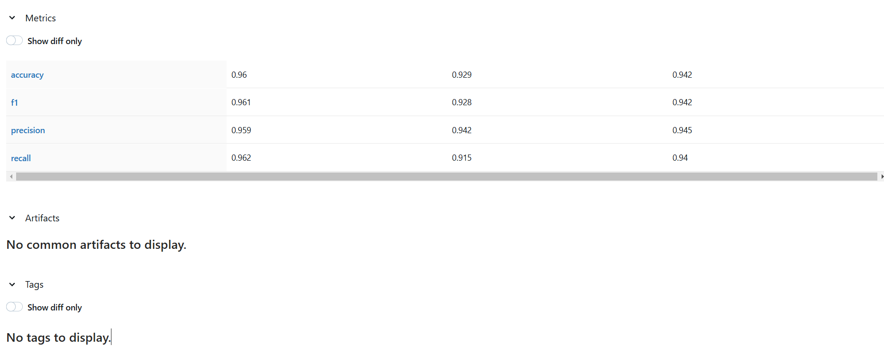
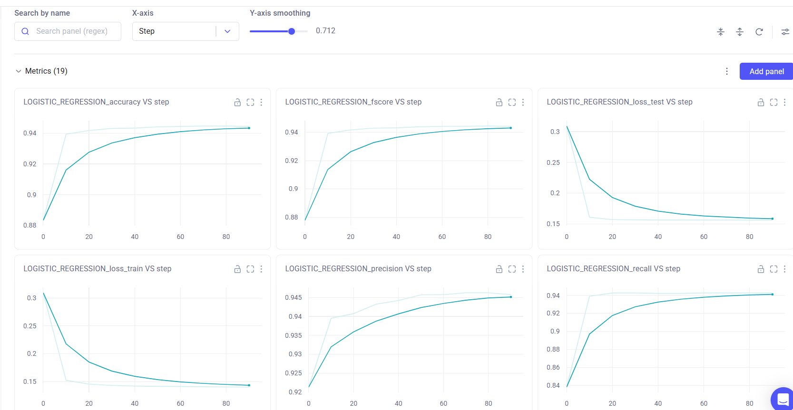
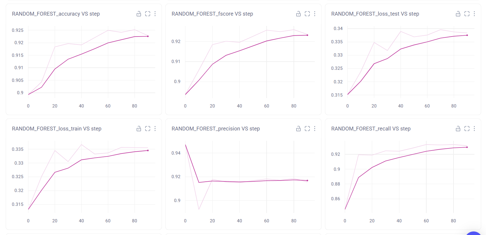
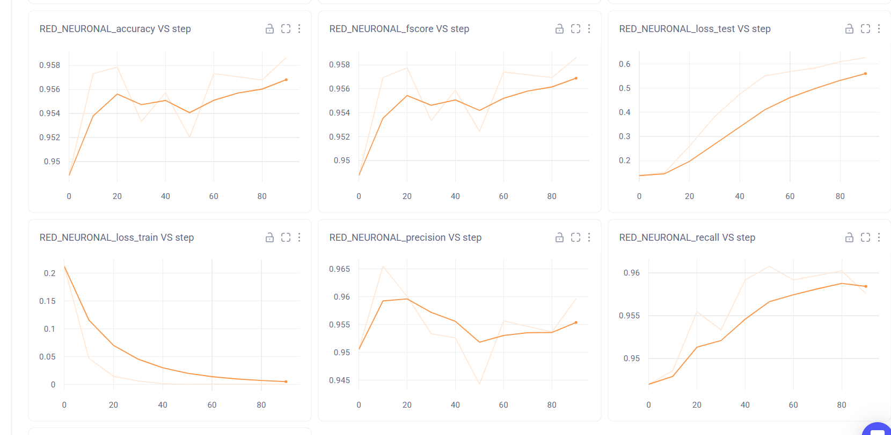

# Monitoreo de proyectos ML-IA

Este repositorio presenta el monitoreo de un modelo de red neuronal diseñado para la clasificación de URLs con el objetivo de detectar phishing. Para el entrenamiento, se utilizó el conjunto de datos "pirocheto/phishing-url" disponible en Hugging Face.

Además, el proceso de experimentación y gestión del modelo se llevó a cabo utilizando plataformas especializadas en seguimiento y optimización de modelos de machine learning las cuales son:

- MLflow
-	Comet ML

El repositorio incluye diversos scripts para cada una de las funciones de las plataformas utilizadas. También se detallan los requisitos necesarios para su funcionamiento óptimo, las instrucciones de instalación y la licencia correspondiente.

# Tabla de contenido
- [Introducción](#introducción)
    - [Phishing](#Phishing)
    - [Dataset](#Dataset)
- [Modelos de clasificación seleccionados](#Modelos-de-clasificación-seleccionados)
    - [Red Neuronal Multicapa (MLP)](#Red-Neuronal-Multicapa-(MLP))
    - [Regresión Logística](#Regresión-Logística)
    - [Árbol de decisión](#Árbol-de-decisión)
    - [Bosque aleatorio](#Bosque-aleatorio)
- [Estructura del repositorio](#Estructura-del-repositorio)
- [Archivos del repositorio](#archivos-del-repositorio)
    - [comet/config_comet.py](#comet/config_comet.py)
    - [comet/models_commet.py](#comet/models_commet.py) 
    - [comet/train_comet.py](#comet/train_comet.py)  
    - [ml_flow/ml_flow_model.py](#ml_flow/ml_flow_model.py)
    - [ml_flow/ml_flow_train.py](#ml_flow/ml_flow_train.py)
    - [data.py](#data-py)
    - [evaluate.py](#evaluate-py)
 - [Requerimientos para usar el monitoreo del modelo](#requerimientos-para-usar-el-monitoreo-del-modelo)
    - [Comet ML](#Comet-ML)
    - [MLflow](#MLflow)
-  [Dockerizacion](#dockerización)
 - [Integrantes del proyecto](#Integrantes-del-proyecto)


  
# Introducción
## Phishing

El phishing es un tipo de ciberataque basado en ingeniería social, en el cual los atacantes utilizan correos electrónicos, mensajes de texto o sitios web fraudulentos para engañar a las personas y robar información confidencial, como contraseñas, datos bancarios o credenciales de acceso.
Para prevenir estos ataques, es posible aplicar análisis de URLs y patrones de comportamiento mediante técnicas de inteligencia artificial y aprendizaje automático. Estas estrategias permiten detectar actividades sospechosas y bloquear posibles amenazas antes de que los usuarios sean víctimas del fraude.

## Dataset 

El dataset Phishing URL (https://huggingface.co/datasets/pirocheto/phishing-url) consta de un total de 11430 registros, donde cada registro tiene 89 columnas y la última de ellas es la variable objetivo llamada "status" con dos posibles valores que son: legitimate y/o phishing. Con este dataset es posible entrenar un modelo de Machine Learning con el fin de determinar si una página es phising o es legítima.

Las columnas o características del dataset corresponden a tres clases diferentes que son:

- 56 características son extraídas de la estructura y sintaxis de las URL.
- 24 características son extraídas del contenido de sus páginas correspondientes.
- 7 características son extraídas consultando servicios externos.

Es importante aclarar que la característica URL no se tendrá en cuenta en el estudio porque se han extraído 56 características a partir de la estructura y sintaxis de las URL tales como longitud, número de subdominios, uso de caracteres sospechosos, entonces no sería necesario la URL completa en el dataset, ayudando a evitar que el modelo dependa de información irrelevante o difícil de procesar directamente.

El dataset proporcionado por Hugging Face ya tiene dividido los datos de tal manera que las dos terceras partes de los datos, que equivale a 7658 registros son datos de entrenamiento. El otro tercerio de datos que equivale a 3772 registros son datos de prueba.

Hablando del tipo de datos de las características se observa que la mayoría de los datos son numéricos, a excepción de las características URL y de la variable objetivo status que contiene dos posibles valores que son: legitimate y/o phishing. Además, el dataset está completo ya que no presenta valores vacíos o nulos.

Por último y no menos importante, se indica que el dataset está balanceado ya que contiene el 50% de los datos pertenecientes al estado legítimo y la otra mitad de los datos corresponden a phising.

# Modelos de clasificación seleccionados

## Red Neuronal Multicapa (MLP)

El modelo de clasificación elegido fue una red neuronal multicapa (MLP) debido a su capacidad para aprender patrones complejos y generalizar el conocimiento en datos de alta dimensión. Su adaptabilidad le permite ajustarse a cambios en la información, mejorando su rendimiento frente a nuevas amenazas de phishing. Además, su habilidad para manejar grandes volúmenes de datos contribuye a reducir el número de falsas detecciones, asegurando un sistema robusto y eficiente en la identificación de URLs maliciosas.

La estructura de la red es la siguiente


Los parametros utilizados son:

- Neuronas: 64
- Activación: Relu
- Optimizer: RMSprop
- Epochs: 10
- Batch size: 32

## Regresión Logística

Es un método de regresión útil para resolver problemas de clasificación binaria, es un algoritmo de clasificación que se utiliza para predecir la probabilidad de una variable dependiente categórica. En la Regresión Logística, la variable dependiente es una variable binaria que contiene datos codificados como 0 o 1.

La Regresión Logística es uno de los algoritmos de Machine Learning más simples y más utilizados para la clasificación de dos clases. Describe y estima la relación entre una variable binaria dependiente y las variables independientes. Este modelo logístico binario se utiliza para estimar la probabilidad de una respuesta binaria basada en una o más variables predictoras o independientes. Permite decir que la presencia de un factor de riesgo aumenta la probabilidad de un resultado dado un porcentaje específico.

## Árbol de decisión

Es un algoritmo de aprendizaje supervisado no paramétrico, que se utiliza tanto para tareas de clasificación como de regresión. Tiene una estructura jerárquica de árbol, que consta de un nodo raíz, ramas, nodos internos y nodos hoja.

El aprendizaje de árboles de decisión emplea una estrategia de divide y vencerás realizando una búsqueda para identificar los puntos de división óptimos dentro de un árbol. Este proceso de división se repite de forma descendente y recursiva hasta que todos o la mayoría de los registros se hayan clasificado con etiquetas de clase específicas. Para reducir la complejidad y evitar el sobreajuste del modelo, se suele emplear la poda, se trata de un proceso que elimina las ramas que se dividen en características con poca importancia.

## Bosque aleatorio

Es un algoritmo de machine learning de uso común que combina la salida de múltiples árboles de decisión para llegar a un único resultado. Su facilidad de uso y flexibilidad han impulsado su adopción, ya que maneja tanto problemas de clasificación como de regresión.

El bosque aleatorio utiliza la aleatoriedad de las características para crear un bosque no correlacionado de árboles de decisión, generando un subconjunto aleatorio de características, lo que garantiza una baja correlación entre los árboles de decisión. Esta es una diferencia clave entre los árboles de decisión y los bosques aleatorios. Mientras que los árboles de decisión consideran todas las posibles divisiones de características, los bosques aleatorios solo seleccionan un subconjunto de esas características.

# Estructura del repositorio

En este repositorio, los archivos han sido organizados de manera estructurada para diferenciar claramente las implementaciones destinadas a las plataformas Comet-ML y MLflow. Esta división permite una mejor gestión del monitoreo y experimentación del modelo, facilitando la integración con cada plataforma según sus características y funcionalidades específicas.

A nivel general, la estructura del proyecto es la siguiente:

1. Directorios principales:

- imagenes/ Contiene las imágenes utilizadas en el proyecto.
- src (source)/ Contiene el código fuente del proyecto, organizado en los siguientes subdirectorios:
    - comet/ Almacena toda la lógica relacionada con la plataforma Comet-ML.
    - ml_flow/ Almacena toda la lógica relacionada con la plataforma MLflow.
    - Scripts .py que contienen funcionalidad generica para ambas plataformas.
- test/ Almacena las pruebas unitarias del proyecto que se ejecutan con pytest.

2. Archivos en la raíz del proyecto:
- gitignore: Define los archivos y carpetas que deben ser ignorados en el control de versiones con Git.
- Dockerfile: Especifica las instrucciones para construir el contenedor Docker del proyecto.
- main_comet.py: Archivo principal que sirve como punto de entrada para ejecutar Comet-ML.
- main_ml_flow.py: Archivo principal que sirve como punto de entrada para ejecutar MLflow.
- README.md: Documento con información detallada sobre el uso y configuración del proyecto.
- requirements.txt: Lista de dependencias de Python necesarias para la ejecución del proyecto.
- LICENSE.txt: Contiene la licencia del proyecto, especificando los términos de uso y distribución del código.

# Archivos del repositorio

## comet/config_comet.py

Este script maneja la configuración inicial de Comet-ML para iniciar el experimento que requiere datos como api_key, project_name y workspace, además contiene los parámetros de los modelos que se van a visualizar en Comet-ML. Centralizar la configuración en este archivo facilita la modificación y mantenimiento del sistema sin afectar otros módulos.

## comet/models_commet.py

Este script contiene los modelos que serán visibles en Comet-ML, dichos modelos son: Regresión Logística, Bosque aleatorio y una Red Neuronal Artificial. Al separar esta funcionalidad, se garantiza un mejor desacoplamiento del sistema, permitiendo reutilizar los modelos en diferentes partes de la aplicación.

## comet/train_comet.py

Este script contiene toda la parametrización necesaria y requerida por Comet-ML para poder iniciar con el experimento, estableciendo las métricas que se harán seguimiento, carga de datos, y carga de los modelos para realizar los cálculos de las métricas durante el entrenamiento del modelo a través del tiempo y poder realizar las gráficas.

## ml_flow/ml_flow_model.py

Este script contiene los modelos que serán visibles en MLflow, dichos modelos son: Regresión Logística, Árbol de decisión y Bosque aleatorio. Al separar esta funcionalidad, se garantiza un mejor desacoplamiento del sistema, permitiendo reutilizar los modelos en diferentes partes de la aplicación.

## ml_flow/ml_flow_train.py

Este script contiene toda la parametrización necesaria y requerida por MLflow para poder iniciar con el experimento, estableciendo las métricas que se harán seguimiento, carga de datos, y carga de los modelos para realizar los cálculos de las métricas durante el entrenamiento del modelo a través del tiempo y poder realizar las gráficas.

## data.py

Este script contiene la función para cargar los datos desde Hugging Face, de tal manera que separa los datos de entrenamiento y de prueba. Al tener este archivo con una única responsabilidad, cuando sea necesario cambiar la fuente de datos, solo se necesitaría modificar este archivo.

## evaluate.py

Este script contiene funciones para evaluar el modelo, calcular las métricas y generar la matriz de confusión. Estas funcionalidades se centralizan en este script, ya que son varios modelos que se deben evaluar tanto en Comet-ML como MLflow.

# Requerimientos para usar el monitoreo del modelo

Para ejecutar correctamente el monitoreo del modelo de red neuronal, siga los siguientes pasos:

1. Se debe clonar la información del repositorio uao-neumonia  el cual se encuentra en el siguiente enlace https://github.com/UAOFranciscoRivera901/uao-mlflow
2. Asegúrate de tener Python instalado en tu ordenador. Se recomienda usar la versión Python 3.12.2
3. crear y configurar un entorno virtual: Puede craer su entorno virtual desde la consola del sistema o puede usar VS Code. Nota: Un entorno virtual es un espacio aislado dentro de tu sistema donde puedes instalar bibliotecas y dependencias necesarias para un proyecto, sin afectar el resto del sistema ni otras aplicaciones.
- Si desea usar VS Code estas son las instrucciones a seguir:
- Inicia Visual Studio Code desde el directorio donde has clonado el repositorio del proyecto.
- Puedes abrir la barra de comandos presionando ctrl + Shift + P.
- Escribe y busca la opción "Python: Crear un entorno virtual" para crear el entorno virtual.
- Selecciona la opción "Crear entorno virtual (.venv)
- Asegúrate de elegir la versión Python  3.12.2
- No olvides seleccionar el archivo requirements.txt. Este archivo contiene todas las bibliotecas y dependencias necesarias para el funcionamiento correcto del proyecto.
  
# Uso de las plataformas especializadas en seguimiento y optimización de modelos de machine learning

## Comet ML

Comet ML es una plataforma diseñada para rastrear, comparar y optimizar modelos y experimentos de aprendizaje automático. Permite registrar métricas y parámetros durante el entrenamiento y supervisarlos de manera interactiva a través de su interfaz web.

 Para iniciar el experimento (entrenamiento del modelo) siga los siguientes pasos:

 ## Paso 1: Generación del Token

 Inicialmente se debe enlazar con la plataforma web, para esto se debe hacer los siguiente:
 
 - Crear una cuenta gratuita en Comet ML https://www.comet.com/site/
 - Obtener la API Key desde la plataforma.
 - Ubicar esta API Key en el archivo Comet_logger.py.
 - Definir el nombre del proyecto en Project_name y el nombre de usuario en Workspace.

 ## Paso 2: Definir las Métricas y Parámetros

 Las métricas que se registrarán durante el entrenamiento del modelo se configuran en el archivo train.py mediante self.experiment.log_metric. Las métricas son:
 
 - Train y val loss
 - Train y val Accuracy
 - Train y val Precisión
 - Train y val Recall

 ## Paso 3: Iniciar el Entrenamiento

 Abrir una terminal o línea de comandos en la carpeta donde se encuentra el archivo main_comet.py.

 Ejecuta el siguiente comando: 
 
 -	Python main_comet.py

La terminal generará un enlace que redirige a la interfaz web de Comet ML, donde podrás visualizar el experimento en tiempo real.
 
## Interfaz web Comet ml

Comet ML proporciona una interfaz interactiva donde se pueden analizar los resultados del entrenamiento.
- Metrics: Visualización de métricas registradas.
- Hyperparameters: Listado de hiperparámetros utilizados en el entrenamiento.
- Confusion Matrix: Matriz de confusión generada.
- Graphics: Imágenes y gráficos guardados durante el proceso.

La pestaña panels presenta todas las gráficas interactivas donde se puede observar y analizar el comportamiento de las métricas registradas en todo el proceso del entrenamiento tal como se muestra en la siguiente imagen:


Una de las ventajas de Comet ml es que permite agregar panels personalizados donde se puede visualizar las métricas de preferencia del usuario como se ve en la siguiente imagen:


Esto es útil si se quiere visualizar y/o comparar métricas simultaneas como la pérdida del conjunto de entrenamiento y validación.

## ML flow

MLflow es una herramienta open source diseñada para gestionar el ciclo de vida de los modelos de Machine Learning (ML). Su principal objetivo es facilitar el seguimiento, la reproducción y la implementación de modelos en producción.

dentro de los aspectos principales se destacan

-	Tracking:  Registra los resultados y parámetros del modelo 
-	Projects:  Permite que empaquetar el código para que sea reproducible
-	Models: gestiona el versionamiento del modelo, así como ponerlo en producción en modo de end point.

Para iniciar el experimento (entrenamiento del modelo) siga los siguientes pasos:

 ## Paso 1: Definir las métricas y/o parámetros

 Se establecen las métricas que se registraran durante el enteramiento en callbacks.py por medio de mlflow.log_metric; las métricas son:
 
- Train y val loss
- Train y val Accuracy
- Train y val Precisión
- Train y val Recall

 ## Paso 2: Iniciar el entrenamiento
 
Una de las ventajas de MLflow es que no se debe crear una cuenta de acceso para usar la plataforma, el enlace, registro de resultados y parámetros se hace en train.py

Para iniciar el entrenamiento primero debe abrir una terminal o línea de comandos en la carpeta donde se encuentra el archivo main_ml_flow.py

Escribir el siguiente comando y presionar Enter:

-	Python main_ml_flow.py

Esto iniciara el experiment

## Interfaz web MLflow

Para ver los resultados del enteramiento se debe ejecutar el servidor de MLflow por medio del comando MLflow. ui

En el terminal se indica un URL que redirige a la interfaz web de MLflow

En la interfaz se puede observar y analizar el comportamiento de las métricas registradas en todo el proceso del entrenamiento tal como se muestra en la siguiente imagen:


También se observan los resultados registrados como se indica en la siguiente imagen


## Paso 3: Cerrar la aplicación

Para cerrar la aplicación, simplemente debe cerrar la pestaña del navegador.

En la terminal, presionar Ctrl + C para detener la ejecución.

Bibliografía
- https://anderfernandez.com/blog/tutorial-mlflow-completo/
- https://www.comet.com/site/
- https://www.toolify.ai/es/ai-news-es/una-gua-para-ingenieros-de-ia-sobre-el-monitoreo-de-modelos-con-la-plataforma-comet-ml-1966252
- https://www.incibe.es/aprendeciberseguridad/phishing

# Hallazgos
## En mlFlow
Los resultados obtenidos en MLflow muestran que el Bosque Aleatorio fue el modelo con mejor rendimiento general, logrando una precisión (accuracy) de 0.96, seguido por el Árbol de Decisión con 0.942, y finalmente la Regresión Logística con 0.929. Además, el F1-score, que balancea precisión y recall, también fue superior en el Bosque Aleatorio (0.961) en comparación con los otros modelos. Esto indica que su capacidad de clasificación es más equilibrada y robusta.





En términos de precisión (precision), el Bosque Aleatorio obtuvo 0.959, mientras que el Árbol de Decisión y la Regresión Logística alcanzaron 0.945 y 0.942, respectivamente. Sin embargo, la métrica recall, que mide la capacidad del modelo para identificar correctamente las clases positivas, fue la más alta en el Bosque Aleatorio (0.962), lo que indica que es el modelo más efectivo para minimizar falsos negativos. La Regresión Logística mostró el menor recall (0.915), lo que significa que perdió más casos positivos en la clasificación.



## En Comet
En el análisis de los modelos, observamos que la Regresión Logística muestra una reducción progresiva de la pérdida en entrenamiento, comenzando en 0.65 y disminuyendo hasta 0.21 en las últimas iteraciones. La precisión se mantiene alrededor del 92.9%, mientras que el recall mejora gradualmente hasta 91.5%, lo que indica un buen balance en la predicción de clases positivas y negativas sin evidencias claras de sobreajuste.



El modelo de Random Forest presenta un comportamiento más estable que lo indicado inicialmente, con variaciones en la pérdida de entrenamiento entre 0.45 y 0.30. La precisión se mantiene alta en 95.9%, mientras que el recall alcanza 96.2%, lo que confirma su buen desempeño en la clasificación. Estos valores sugieren que el modelo logra una generalización adecuada, aunque podría beneficiarse de una optimización fina de hiperparámetros.



Por otro lado, la Red Neuronal demuestra una rápida reducción de la pérdida desde 0.80 hasta 0.10, lo que indica un aprendizaje agresivo. La precisión alcanza 94.2%, con fluctuaciones menores, mientras que el recall se mantiene en torno a 94.5%, lo que sugiere que el modelo tiene un buen desempeño en la identificación de casos positivos, aunque podría beneficiarse de técnicas de regularización para mejorar su estabilidad.



# Conclusiones
El Random Forest se consolida como la mejor opción en términos de precisión (95.9%), recall (96.2%) y F1-score, destacándose por su equilibrio entre la detección de verdaderos positivos y la reducción de falsos positivos. Su capacidad de clasificación sigue siendo la más robusta, aunque presenta ligeras variaciones en la pérdida. Esto refuerza la efectividad de los métodos de ensamble sobre modelos más simples, como la Red Neuronal o la Regresión Logística, especialmente en problemas con relaciones no lineales en los datos.

La Regresión Logística, aunque confiable y de bajo costo computacional, obtuvo el rendimiento más bajo (92.9% de precisión y 91.5% de recall), lo que la hace menos adecuada si se busca minimizar falsos negativos. Por su parte, la Red Neuronal, con una precisión de 94.2% y recall de 94.5%, ofrece un rendimiento intermedio y es una alternativa viable cuando se dispone de recursos computacionales suficientes, aunque requiere técnicas de regularización para evitar el sobreajuste. En conclusión, el Random Forest sigue siendo la mejor opción cuando la prioridad es la calidad de la clasificación.

En cuanto a las herramientas mlFlow y comet: Ambas herramientas ofrecen valiosas capacidades para el análisis de modelos, pero su enfoque y métricas resaltan diferentes fortalezas:

-	Comet es útil para analizar tendencias de pérdida y estabilidad en el entrenamiento, permitiendo identificar riesgos de sobreajuste y fluctuaciones en los modelos.
-	MLflow ofrece una evaluación más consolidada con métricas clave como el F1-score, facilitando la comparación global del rendimiento de los modelos.

Para un análisis más robusto, lo ideal es combinar ambas herramientas: usar Comet para el monitoreo del proceso de entrenamiento y análisis de estabilidad, y MLflow para la comparación final de modelos y optimización de hiperparámetros.


# Dockerización

Este proyecto se puede ejecutar dentro de un contenedor Docker utilizando `docker` y `docker-compose`.

## Requisitos Previos

- Tener instalado [Docker](https://www.docker.com/get-started).
- Tener instalado [Docker Compose](https://docs.docker.com/compose/).

## Construcción de la imagen de Docker

Primero, necesitas construir la imagen de Docker para el proyecto. Ejecuta el siguiente comando en la raíz del proyecto (donde se encuentra el archivo `Dockerfile`):

```bash
docker build -t uao-mlflow .
docker compose up
```
El dockercompose ejecuta los dos modelos y la interfaz grafica de mlflow

# Integrantes del proyecto

- Francisco Javier Rivera Rozo
- Carlos Armando Daza Rendón
- Andrés Felipe Coral
- Alejandro Sánchez Murillo
